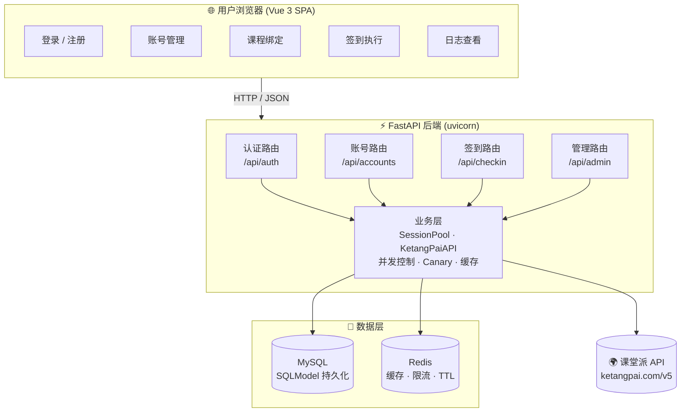

<div align="center">

# 🎯 CheckInHelper · 课堂派签到助手

> 自动化课堂派（ketangpai.com）批量签到 Web 应用  
> 多用户 · 多账号 · 多课程 · 扫码签到 · 全栈管理

[](https://python.org)
[](https://fastapi.tiangolo.com)
[](https://vuejs.org)
[](https://mysql.com)
[](https://redis.io)
[](LICENSE)
[](docker-compose.yml)

</div>

---

## 📋 目录

- [🎯 CheckInHelper · 课堂派签到助手](#-checkinhelper--课堂派签到助手)
    - [📋 目录](#-目录)
    - [概述](#概述)
    - [功能特性](#功能特性)
        - [👤 用户系统](#-用户系统)
        - [🔑 课堂派账号管理](#-课堂派账号管理)
        - [📚 课程绑定](#-课程绑定)
        - [🚀 批量签到](#-批量签到)
        - [📷 扫码签到](#-扫码签到)
        - [📊 签到日志](#-签到日志)
        - [🔐 安全机制](#-安全机制)
        - [🛠️ 管理后台（仅管理员）](#️-管理后台仅管理员)
    - [系统架构](#系统架构)
        - [分层说明](#分层说明)
    - [技术栈](#技术栈)
    - [快速开始](#快速开始)
        - [Docker 部署（推荐）](#docker-部署推荐)
        - [手动部署](#手动部署)
    - [环境变量](#环境变量)
    - [前端界面](#前端界面)
        - [页面路由](#页面路由)
        - [UI 特点](#ui-特点)
    - [API 端点](#api-端点)
        - [认证](#认证)
        - [账号管理](#账号管理)
        - [课程管理](#课程管理)
        - [签到](#签到)
        - [用户管理（管理员）](#用户管理管理员)
        - [邀请码（管理员）](#邀请码管理员)
    - [关键设计](#关键设计)
        - [认证流程](#认证流程)
        - [签到引擎](#签到引擎)
        - [会话池管理](#会话池管理)
        - [扫码签到](#扫码签到)
    - [安全特性](#安全特性)
    - [项目结构](#项目结构)
    - [许可](#许可)

---

## 概述

**CheckInHelper** 是一个面向[课堂派](https://ketangpai.com)（在线教学平台）的签到自动化工具。它提供了一套完整的 **Web 管理界面 + RESTful API**，允许用户：

1. 添加多个课堂派账号（支持手机号/邮箱）
2. 将账号绑定到对应的课程
3. **一次操作**即可为绑定该课程的所有账号同时执行签到
4. 支持扫码识别签到二维码，实现全流程自动化

每个用户可管理独立的课堂派账号池，管理员可控制全局注册、管理用户和邀请码。

## 功能特性

### 👤 用户系统

| 功能        | 说明                                             |
| ----------- | ------------------------------------------------ |
| 注册 / 登录 | 支持邀请码注册（可选强制）和邮箱密码登录         |
| JWT 认证    | Access Token + Refresh Token Rotation 双令牌机制 |
| 角色管理    | `admin` 和 `user` 两级角色，权限分离             |
| 密码管理    | 修改密码、密码强度校验（含大小写字母+数字）      |

### 🔑 课堂派账号管理

- 添加账号时自动通过课堂派 API **验证凭据有效性**
- 密码使用 **Fernet (AES-128-CBC + HMAC)** 加密存储
- 已存在账号自动关联，多个用户可共享同一课堂派账号
- 添加成功后自动拉取学期课程列表并创建绑定
- 自动获取并存储用户详情：姓名、学校、学号、院系、手机号、头像
- 凭据验证按钮：随时手动重新验证账号状态，验证成功时同步刷新用户信息
- 更新密码时自动重置账号状态并重新登录验证

### 📚 课程绑定

- 灵活的多对多绑定关系：一个账号可绑定多个课程，一个课程可分配给多个账号
- 按课程启用/禁用签到开关，精细化控制
- 解绑时自动清理无引用的课程记录

### 🚀 批量签到

- **Canary 模式**：先用一个账号测试签到有效性，成功后再并发处理其余账号
- 签到结果区分成功、重复签到（视同成功）、二维码过期、考勤已结束
- 全局失败缓存：二维码过期/考勤结束后跳过所有账号，避免无效请求
- **Redis 签到去重**：同一 ticketid 下已签到成功的账号自动跳过，防止重复调用 API
- 签到结果实时显示，支持失败原因查看
- **客户端 IP 透传**：签到请求经过后端时自动提取客户端真实 IP，以 `X-Forward-For` 请求头传递至课堂派 API，避免所有签到请求显示为同一服务器 IP

### 📷 扫码签到

- 调用摄像头实时扫描二维码（**OpenCV WeChat QR** 主解码引擎 + **ZXing WASM** 备用）
- WeChat QR 引擎基于 C++ WASM，对倾斜 / 畸变 / 低光照二维码识别率更高
- 自动校验签到链接域名和参数完整性
- 识别成功后自动填充参数并执行签到
- **HTTP 环境降级**：摄像头不可用时支持拍照识别
- 原生分辨率扫描 + 图像预处理（灰度加权、对比度拉伸）
- 轮询超时机制，避免长时间无结果卡死
- WASM 内存泄漏和 Blob URL 泄漏自动清理

### 📊 签到日志

- 课程维度筛选、按时间倒序排列
- 首页统计面板：账号数、绑定数、今日签到、累计记录
- 签到明细查看（失败原因可追溯）
- 每条日志附带签到结果描述（成功 / 二维码过期 / 重复签到等）

### 🔐 安全机制

- Argon2 密码哈希
- JWT 吊销 + Refresh Token Rotation（防止重放攻击）
- 速率限制（Redis 滑动窗口）
- Redis 断路器模式（健康检查 + 自动恢复）
- CORS 白名单
- Fernet 凭据加密

### 🛠️ 管理后台（仅管理员）

- 用户管理（创建/编辑/禁用/删除）
- 全部课堂派账号查询
- 邀请码生成与管理
    - **三态模型**：有效 / 停用 / 失效
    - 支持使用次数上限和过期时间
    - 可切换强制/可选注册模式

## 系统架构



### 分层说明

| 层级         | 职责                                                    |
| ------------ | ------------------------------------------------------- |
| **前端 SPA** | Vue 3 响应式 UI，MDUI 2 Material Design 组件，Hash 路由 |
| **API 路由** | FastAPI 路由，依赖注入（DB Session / Redis / 当前用户） |
| **业务逻辑** | 会话池管理、第三方 API 封装、Canary 签到策略            |
| **数据层**   | SQLModel ORM（MySQL）+ Redis 缓存 + 速率限制            |
| **外部依赖** | 课堂派 OpenAPI v5 + 签到页面接口                        |

## 技术栈

| 层级       | 技术                                         | 用途                                                  |
| ---------- | -------------------------------------------- | ----------------------------------------------------- |
| **后端**   | **Python 3.13+** → **FastAPI** → **uvicorn** | 高性能异步 Web 框架                                   |
| ORM        | **SQLModel** + **PyMySQL**                   | 类型安全的异步 ORM                                    |
| 数据库     | **MySQL 8.0**                                | 持久化存储                                            |
| 缓存       | **Redis 7**                                  | JWT 黑名单、会话 Token 缓存、速率限制、邀请码设置缓存 |
| **前端**   | **Vue 3** (Composition API)                  | 响应式 SPA                                            |
| UI 框架    | **MDUI 2** (Web Components)                  | Material Design 界面                                  |
| 图标       | **Material Icons**                           | 图标系统                                              |
| 扫码(主)  | **OpenCV.js (WeChat QR)**                    | C++ WASM 解码引擎，抗畸变倾斜，识别率更高             |
| 扫码(备)  | **ZXing WASM**                               | WASM 备用 QR 解码引擎                                |
| **安全**   | **Passlib (Argon2)**                         | 密码哈希                                              |
|            | **PyJWT**                                    | JWT 签发与验证                                        |
|            | **Cryptography (Fernet)**                    | 凭据加密                                              |
|            | **Rate Limiter**                             | Redis 滑动窗口限流                                    |
| **包管理** | **uv**                                       | Python 依赖管理                                       |
| **部署**   | **Docker** + **docker compose**              | 容器化一站式部署                                      |

## 快速开始

### Docker 部署（推荐）

确保已安装 Docker 和 docker compose，然后在项目目录执行：

```bash
# 1. 克隆项目
git clone https://github.com/Dinosaur-MC/KetangPai-CheckInHelper && cd CheckInHelper

# 2. 创建环境变量（至少设置 JWT_SECRET）
cp .env.example .env
# 编辑 .env，设置 JWT_SECRET 等配置

# 3. 一键启动全部服务（MySQL + Redis + App）
docker compose up -d

# 4. 查看日志
docker compose logs -f app
```

> **首次启动会自动创建数据库表**，MySQL 和 Redis 通过健康检查确保就绪后应用才会启动。

```bash
# 停止
docker compose down

# 停止并删除数据卷
docker compose down -v
```

### 手动部署

**环境要求：** Python ≥ 3.13，MySQL 8.0，Redis 7

```bash
# 1. 安装依赖
uv sync

# 2. 配置环境变量
cp .env.example .env
# 编辑 .env，至少配置 DATABASE_URL 和 JWT_SECRET

# 3. 确保 MySQL 和 Redis 已运行

# 4. 启动服务
uv run python main.py
```

服务默认监听 `http://0.0.0.0:8765`。

## 环境变量

项目通过 `.env` 文件配置，所有配置项由 `app/core/settings.py`（pydantic-settings）统一管理：

> **注意**：`DATABASE_URL` 和 `CREDENTIAL_KEY` 为 **必需项**，未设置时启动会报错退出。

| 变量               | 说明                     | 默认值                             |
| ------------------ | ------------------------ | ---------------------------------- |
| `DATABASE_URL`     | **MySQL 连接串（必填）** | 无（未设置时启动失败）             |
| `REDIS_URL`        | Redis 连接串             | `redis://localhost:6379/0`         |
| `JWT_SECRET`       | **JWT 签名密钥（必填）** | 未设置时随机生成（重启后失效）     |
| `JWT_ALGORITHM`    | JWT 算法                 | `HS256`                            |
| `JWT_EXPIRE_HOURS` | Access Token 有效期      | `24`（小时）                       |
| `CREDENTIAL_KEY`   | **课堂派密码加密密钥（必填）** | 无（未设置时启动失败）        |
| `ALLOWED_ORIGINS`  | CORS 白名单（逗号分隔）  | 空（不允许跨域）                   |
| `PORT`             | 服务端口                 | `8765`                             |
| `DEBUG`            | 调试模式（热重载）       | `false`                            |
| `DB_ECHO`          | 打印 SQL 日志            | `false`                            |
| `DB_POOL_SIZE`     | 数据库连接池大小         | `10`                               |
| `DB_MAX_OVERFLOW`  | 连接池最大溢出           | `20`                               |
| `DB_POOL_RECYCLE`  | 连接回收时间（秒）       | `3600`                             |
| `DB_AUTO_MIGRATE`  | 启动时自动运行增量迁移   | `true`                             |

> **生成 `CREDENTIAL_KEY`：**
>
> ```bash
> uv run python -c "from cryptography.fernet import Fernet; print(Fernet.generate_key().decode())"
> ```

## 前端界面

### 页面路由

| 路由          | 页面     | 说明                  |
| ------------- | -------- | --------------------- |
| `#/login`     | 登录     | 邮箱密码登录          |
| `#/register`  | 注册     | 支持邀请码注册        |
| `#/dashboard` | 首页概览 | 统计卡片 + 最近签到   |
| `#/accounts`  | 账号管理 | 管理课堂派账号        |
| `#/courses`   | 课程绑定 | 绑定课程到账号        |
| `#/checkin`   | 签到执行 | URL/手动/扫码三种方式 |
| `#/logs`      | 签到日志 | 历史记录查看与筛选    |
| `#/users`     | 用户管理 | 管理员专用            |

### UI 特点

- **响应式设计**：桌面端侧边栏布局，移动端底部 Sheet 导航
- **安全区域适配**：支持 iOS 刘海屏和移动端 Edge 底部工具栏
- **FAB 快捷操作**：首页浮动按钮直达签到页
- **Toast 通知**：操作结果实时反馈

## API 端点

完整的 OpenAPI 文档可在启动后访问：

- Swagger UI：[`http://localhost:8765/docs`](http://localhost:8765/docs)
- ReDoc：[`http://localhost:8765/redoc`](http://localhost:8765/redoc)

> **分页说明**：所有列表接口均支持 `page` 和 `page_size` 查询参数（默认 `page=1, page_size=20`），响应额外返回 `total`、`page`、`page_size` 字段。

### 认证

| 方法 | 路径                 | 说明                                          | 权限   |
| ---- | -------------------- | --------------------------------------------- | ------ |
| POST | `/api/register`      | 用户注册（可选 `invite_code`）                | 公开   |
| POST | `/api/login`         | 登录（返回 `access_token` + `refresh_token`） | 公开   |
| POST | `/api/refresh`       | 刷新令牌（Rotation 防重用）                   | 公开   |
| POST | `/api/logout`        | Token 吊销                                    | 已登录 |
| PUT  | `/api/user/password` | 修改当前用户密码                              | 已登录 |

### 账号管理

| 方法   | 路径                 | 说明                                    |
| ------ | -------------------- | --------------------------------------- |
| GET    | `/api/accounts`      | 当前用户的课堂派账号列表（分页）       |
| GET    | `/api/accounts/{id}` | 获取指定账号信息                   |
| POST   | `/api/accounts`      | 添加课堂派账号（已存在则自动关联） |
| PUT    | `/api/accounts/{id}` | 更新账号信息（更新密码会自动重置状态并刷新详情） |
| POST   | `/api/accounts/{id}/verify` | 重新验证账号凭据有效性，刷新用户详情 |
| DELETE | `/api/accounts/{id}` | 删除账号                           |

### 课程管理

| 方法   | 路径                         | 说明                           |
| ------ | ---------------------------- | ------------------------------ |
| GET    | `/api/courses`               | 课程列表，管理员查看全部（分页） |
| GET    | `/api/courses/{id}`          | 课程详情                   |
| DELETE | `/api/courses/{id}`          | 删除课程（管理员）         |
| GET    | `/api/courses/bindings`      | 当前用户的课程绑定（分页） |
| POST   | `/api/courses/bindings`      | 创建课程绑定               |
| PUT    | `/api/courses/bindings/{id}` | 切换绑定启用状态           |
| DELETE | `/api/courses/bindings/{id}` | 解绑                       |

### 签到

| 方法   | 路径                     | 说明                                                |
| ------ | ------------------------ | --------------------------------------------------- |
| POST   | `/api/checkin`           | 批量签到（Canary 模式）                             |
| GET    | `/api/logs/checkin`      | 签到日志列表，支持 `account_id`/`course_id` 筛选 + 分页 |
| GET    | `/api/logs/checkin/{id}` | 签到日志详情                                        |
| DELETE | `/api/logs/checkin/{id}` | 删除签到日志（管理员）                              |

### 用户管理（管理员）

| 方法   | 路径                  | 说明                         |
| ------ | --------------------- | ---------------------------- |
| GET    | `/api/users`          | 用户列表（分页）             |
| GET    | `/api/users/{id}`     | 用户详情                     |
| POST   | `/api/users`          | 创建用户                     |
| PUT    | `/api/users/{id}`     | 更新用户（角色、状态、密码） |
| DELETE | `/api/users/{id}`     | 删除用户                     |
| GET    | `/api/admin/accounts` | 全部课堂派账号（分页）       |

### 邀请码（管理员）

| 方法   | 路径                            | 说明                               |
| ------ | ------------------------------- | ---------------------------------- |
| GET    | `/api/invite-codes`             | 邀请码列表（分页）                 |
| POST   | `/api/invite-codes`             | 生成邀请码（留空自动生成 16 位码） |
| PUT    | `/api/invite-codes/{id}`        | 编辑（启用/停用/备注/次数上限）    |
| DELETE | `/api/invite-codes/{id}`        | 删除邀请码                         |
| GET    | `/api/settings/invite-required` | 获取邀请码强制状态                 |
| PUT    | `/api/settings/invite-required` | 切换强制邀请码注册                 |

## 关键设计

### 认证流程

```
登录/注册
    │
    ▼
返回 access_token + refresh_token
    │
    ├── access_token ── 短期有效（默认 24小时），用于请求认证
    │
    └── refresh_token ── 长期有效（默认 30天），用于令牌刷新
                            │
                            ▼
                        令牌刷新（Rotation 策略）
                            │
                            ├── 旧 refresh_token 标记为"已使用"
                            ├── 返回新的令牌对
                            └── 旧 access_token 登出时加入黑名单
```

**前端降级策略：**

- 本地解码 JWT `exp` 字段预判过期，直接清除不发起无效请求
- 拦截 401 后自动用 `refresh_token` 换新令牌并重试原请求
- 页面刷新保持登录状态

### 签到引擎

**Canary 模式 — 先测后发：**

```
收到签到请求（包含课程 ID + 签到参数）
    │
    ├── 查询该课程绑定的所有账号
    │
    ├── Canary 测试 ────────────────► 选第一个可用账号试签
    │       │                              │
    │       │                        ┌─────┴─────┐
    │       │                    成功 ▼           ▼ 失败
    │       │                  ┌──────────┐  缓存"签到无效"标记
    │       │                  │ 并发签到  │  (3600秒内跳过)
    │       │                  │ 所有账号  │
    │       │                  └──────────┘
    │       │                       │
    ▼       ▼                       ▼
记录签到日志（每个账号一条，含状态+消息）
```

**并发控制：**

- `asyncio.Semaphore(5)` 限制同一批次对课堂派 API 的并发数
- `asyncio.Lock` 序列化签到批次的执行阶段
- 失败缓存：`checkin:{courseid}:invalid:{ticketid}` 避免重复无效请求
- 成功去重：`checkin_done:{ticketid}:{account_id}` 防止同一 ticket 下重复调用签到 API

### 会话池管理

```
SessionPool（模块级单例）
    │
    ├── clients: { account_id → (KetangPaiAPI, last_used) }
    │
    ├── TTL 30 分钟 ── 过期自动清理
    │
    ├── Token 缓存 Redis 5 天 ── 减少重复登录
    │
    ├── 按需重建 ── 无会话时从 DB 读取凭据并自动登录
    │
    └── 三层锁：
        ├── threading.Lock    保护 clients 字典（线程安全）
        ├── asyncio.Lock      序列化签到批次（协程安全）
        └── asyncio.Semaphore 控制并发请求数
```

### 扫码签到

```
扫码对话框打开
    │
    ├── 尝试打开后置摄像头（getUserMedia）
    │       │
    │       ├── 成功 → 实时视频流
    │       │          │
    │       │          ├── 逐帧截取 canvas（720p 上限）
    │       │          ├── 灰度加权 + 对比度拉伸预处理
    │       │          ├── OpenCV WeChat QR 解码（主引擎）
    │       │          │       │
    │       │          │       ├── 成功 → 匹配域名参数 → 自动签到
    │       │          │       └── 失败 → ZXing WASM 备用解码
    │       │          │                  │
    │       │          │                  └── 匹配域名参数 → 自动签到
    │       │          │
    │       │          └── 轮询超时 → 停止扫描，提示重试
    │       │
    │       └── 失败 → 提示"使用拍照扫描"
    │
    └── 拍照扫描（降级方案）
              │
              ├── 调用系统相机（<input capture="environment">）
              ├── 加载照片 → canvas 绘制 → OpenCV WeChat QR 解码
              │                            │
              │                            └── 失败 → ZXing 备用解码
              └── 解析成功 → 自动签到
```

## 安全特性

| 措施                       | 实现                                                |
| -------------------------- | --------------------------------------------------- |
| **密码哈希**               | Argon2 via Passlib — 慢哈希抗暴力破解               |
| **JWT 签名**               | HS256/RS*/ES* 可选，密钥至少 16 字符                |
| **Refresh Token Rotation** | 每次刷新使旧 token 失效，防止泄露后重放             |
| **Token 吊销**             | 登出时将 `jti` 加入 Redis 黑名单，TTL 自动过期      |
| **速率限制**               | Redis 滑动窗口 — 登录/注册 5次/分钟，签到 10次/分钟 |
| **Redis 熔断**             | 断路器模式，30s 健康检查间隔自动恢复；3s 短超时防连接卡死 |
| **凭据加密**               | Fernet (AES-128-CBC + HMAC) 加密课堂派密码，**启动时强制校验密钥存在** |
| **登录业务校验**           | 检查 API 返回 status 及 token，拒绝业务级失败（如密码过期） |
| **状态追踪**               | 每个账号记录 `status_message`，失败原因可追溯       |
| **密码强度**               | 8-128 字符，必须包含大小写字母和数字                |
| **CORS**                   | `ALLOWED_ORIGINS` 白名单机制，可配置多个来源        |
| **SQL 注入防护**           | SQLModel 参数化查询                                 |
| **客户端 IP 透传**         | 签到请求自动提取客户端真实 IP，以 `X-Forward-For` 透传至课堂派 API |
| **异常处理**               | 全局异常处理器，敏感信息不暴露                      |

## 项目结构

```
CheckInHelper/
├── main.py                 # 🔵 入口 — uvicorn 启动
├── pyproject.toml          # 📦 依赖管理（uv）
├── .env.example            # 🔧 环境变量模板
├── Dockerfile              # 🐳 Docker 多阶段构建
├── docker-compose.yml      # 🐳 一键启动 (MySQL + Redis + App)
├── favicon.ico             # 🖼️ 网站图标
├── CLAUDE.md               # 🤖 Claude Code 项目指令
│
├── app/                    # 🧩 后端核心
│   ├── main.py             # FastAPI 应用、中间件、异常处理、路由注册
│   ├── api.py              # 课堂派第三方 API 客户端
│   ├── models.py           # SQLModel 数据模型定义
│   ├── deps.py             # 共享 FastAPI 依赖（get_current_user 等）
│   ├── utils.py            # 工具函数（RateLimiter、分页、IP 检测）
│   ├── core/               # ⚙️ 核心基础设施
│   │   ├── settings.py     # 集中配置（pydantic-settings，读取 .env）
│   │   ├── security.py     # 密码哈希 · JWT 签发 · 凭据加密
│   │   ├── sessions.py     # 会话池（异步签到 · 并发限流）
│   │   └── db.py           # MySQL + Redis 连接池（断路器模式）
│   ├── routers/            # 🧭 领域路由模块（替代单文件巨石）
│   │   ├── auth.py         # 注册 / 登录 / 登出 / 刷新令牌
│   │   ├── user.py         # 用户 CRUD + 修改密码
│   │   ├── account.py      # 课堂派账号 CRUD + 验证 + 级联删除
│   │   ├── course.py       # 课程 CRUD + 课程绑定 CRUD
│   │   ├── checkin.py      # 批量签到执行
│   │   ├── invite_code.py  # 邀请码 CRUD
│   │   ├── log.py          # 签到日志列表 / 详情 / 删除
│   │   └── settings.py     # 系统设置（邀请码开关）
│   └── index.html          # 前端 SPA 模板
│
├── static/                 # 🎨 前端资源（本地化，无 CDN）
│   ├── index.css           # 应用样式
│   ├── index.js            # 应用逻辑（Vue 3 Composition API）
│   ├── mdui.css            # MDUI 2 组件样式
│   ├── mdui.global.js      # MDUI 2 脚本
│   ├── vue.global.prod.js  # Vue 3 运行时
│   ├── material-icons.css  # Material Icons 样式
│   ├── MaterialIcons-Regular.ttf  # 图标字体
│   ├── opencv.js           # OpenCV.js — WeChat QR 解码引擎
│   ├── wechat_qrcode_files.js  # WeChat QR 模型脚本
│   ├── wechat_qrcode_files.data # WeChat QR 模型数据
│   ├── zxing.min.js        # ZXing WASM 备用 QR 解码
│   └── test.html           # QR 解码测试页
│
├── scripts/                # 🛠️ 工具脚本
│   └── backfill_accounts.py  # 补齐旧账号用户详情字段
│
└── .claude/                # 🤖 Claude Code 配置
```

## 许可

**MIT License**

```
仅供学习研究使用。使用本项目时请遵守课堂派的相关服务条款。
```

---

<div align="center">
  <sub>Built with ❤️ for the open source community</sub>
</div>
